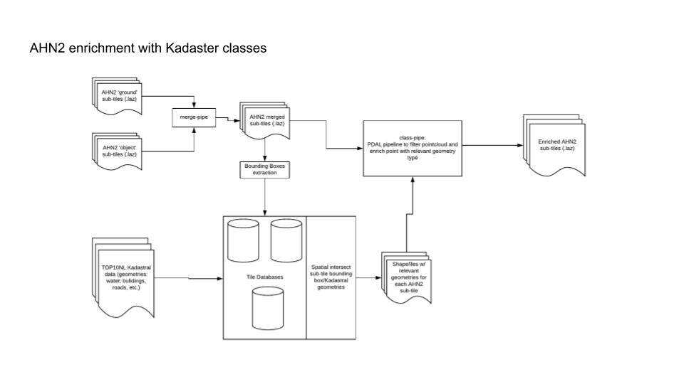

# AHN2_Kadaster
Enrich AHN2 with Kadaster classes

## Workflow
Schematic of the project workflow. A pdf version of this schematic is also located in the repository.



# PostGIS server

Docker image of PostGIS server can be found on [DockerHub organization of eecolidar](https://hub.docker.com/u/eecolidar/).

One can pull the image by running:
```
docker pull eecolidar/postgis
```

## Install docker
[Follow the instructions](https://docs.docker.com/install/) to install docker.


## Change docker volume storage path
```
sudo systemctl stop docker
sudo mkdir /data/local/docker-data
```

Add the lines below to **/etc/docker/daemon.json**:
```
{
	"data-root": "/data/local/docker-data"
}
```

## Start the server
```
sudo docker run -d --name eecolidar-postgis -e POSTGRES_PASSWORD=mysecretpassword -p 5432:5432 docker pull eecolidar/postgis
```

## Setup the firewall
If firewall needs to be configured, the command below opens port for PostGIS server on Ubuntu.
``` 
sudo ufw allow 5432/tcp
```

## Connection to the PostGIS server

### Using pgAdmin (Suggested)

Install [pgAdmin](https://www.pgadmin.org) and follow the [instructions](https://www.pgadmin.org/docs/pgadmin4/3.x/connect_to_server.html).

### Using psql
```
psql -h ServerIP -p 5432 -U postgres
```

#### Using psql from a Docker image
You can also use PostreSQL Docker image to connect to the server.

```
docker pull postgres
docker run --rm -ti postgres /usr/bin/psql --help
```

#### Example Postresql commands

to list databases:
```
\l or \list
```

to connect to a database:
```
\c database_name or \connect database_name
```

to show tables in database_name:
```
\dt+
```

to query data in a table:
```
SELECT * FROM table_name;
```

or

```
SELECT column, column2….
FROM table;
```

to count rows:
```
SELECT COUNT (*)
FROM table_name;
```

### Check database (PostGIS) extensions
In order to use PostGIS functionalities, the extensions should be installed. You can check existing extensions for a database with:
```
\connect database_name
\x
\dx postgis*
```

## GML data

### Displaying GML file information
to show basic info:
```
ogrinfo -fields=YES  TOP10NL_01O.gml
```

to show all the layers and features:
```
ogrinfo -fields=YES -al TOP10NL_01O.gml
```

### Converting GML to CSV
```
ogr2ogr -f "CSV" Top10NL_000001.csv Top10NL_000001.gml
```

### Importing GML file to the server
```
ogr2ogr -f "PostgreSQL" PG:"host=localhost user=postgres dbname=eecolidar password=mysecretpassword" Top10NL_000001.gml
```

adding data to a new table

```
ogr2ogr -f "PostgreSQL" PG:"host=localhost user=postgres dbname=template_postgis password=mysecretpassword" Top10NL_000001.gml -nln newtablename
```


## Bounding boxes

### Importing to PostGIS database
Bounding box information is stored in **bboxes** table of the database. To import bounding box file for Tile02O:

```
ogr2ogr -f "PostgreSQL" PG:"host=localhost user=postgres dbname=Tile02O password=mysecretpassword"  Tile02O_bounding_boxes_geom.csv -nln bboxes
```
```
psql -h localhost -U postgres --dbname='Tile02O' -c "
  ALTER TABLE public.bboxes ADD COLUMN wkb_geometry geometry;
  UPDATE public.bboxes SET wkb_geometry  = ST_GeomFromText(bboxes.geom, 28992);
"
```


## Working with a Database

### to show column details
```
\d+ tabl_name;
```

### show first 10 rows
```
SELECT * FROM table_name LIMIT 10;
```

### Querying intersections

To count the intersections for Tile02O:
```sql
SELECT COUNT(*)
FROM bboxes, waterdeel
WHERE ST_Intersects(bboxes.wkb_geometry, waterdeel.wkb_geometry);
```

To find the intersections for Tile02O specific sub-tile and ogc_fid as sub-tile identifier:
```sql
SELECT bboxes.ogc_fid, bboxes.name, waterdeel.ogc_fid AS waterdeel_ogc_fid, waterdeel.lokaalid AS waterdeel_lokaalid, ST_INTERSECTION(bboxes.wkb_geometry, waterdeel.wkb_geometry), ST_GeometryType(ST_INTERSECTION(bboxes.wkb_geometry, waterdeel.wkb_geometry))
FROM bboxes, waterdeel
WHERE (ST_GeometryType(waterdeel.wkb_geometry) = 'ST_Polygon' AND ST_Intersects(bboxes.wkb_geometry, waterdeel.wkb_geometry) AND bboxes.ogc_fid = 1)
GROUP BY bboxes.ogc_fid, waterdeel.ogc_fid
```


## Data

### Download top10NL data

[Info page](https://www.pdok.nl/downloads?articleid=1976855)


[Direct link](http://geodata.nationaalgeoregister.nl/top10nlv2/extract/kaartbladtotaal/top10nl.zip?formaat=gml) to download.


# Dependencies/Tools

First create a virtual environment
```
python -m venv venv
source ./venv/bin/activate
pip install --upgrade pip
pip install -r requirements.txt
```


# Resources

## PostGIS

PostGIS Documentation is available here:
https://postgis.net/documentation/

Section 4 provides data management andf querying documentation, Section 3 provides immediate answers to FAQ


## PDAL

PDAL documentation is available here:
https://pdal.io

PDAL modules and filters can be combined in pipelines using JSON declaration format. PDAL has been used for mergeing of AHN2 data.
